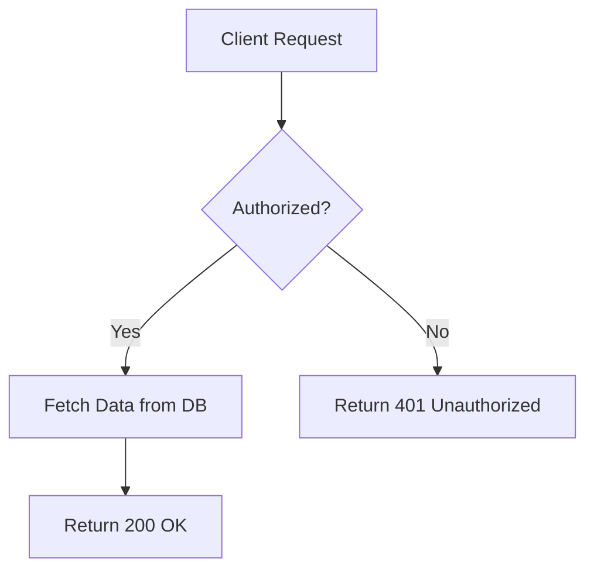
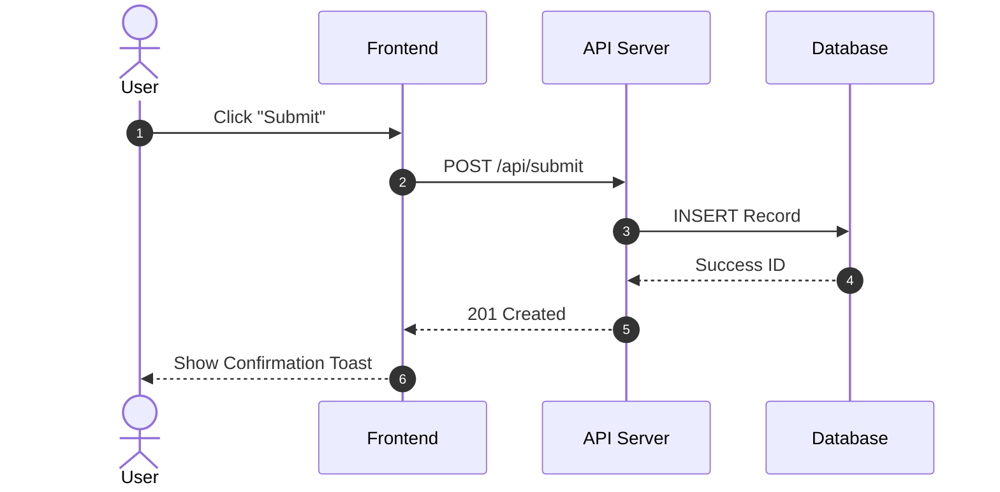
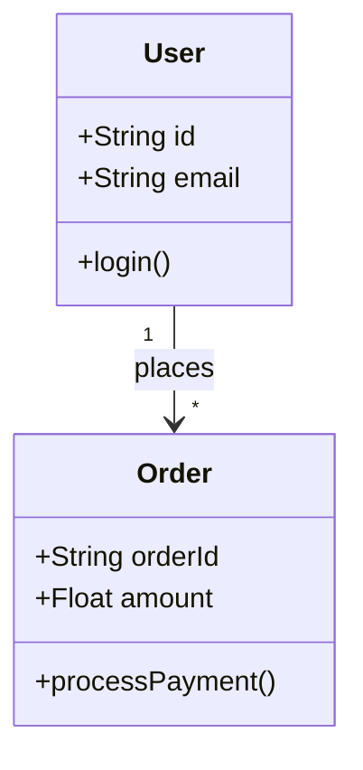

# Master Guide: Output Formatting & Readability in Cline

Improve the readability and structure of your outputs in **Cline** (Claude Dev) by applying standard GitHub Flavored Markdown (GFM), standard Unicode icons, and Mermaid diagrams.

---

## 1. Visual Cues & Icons

Use standard emojis and Unicode symbols as status indicators, warnings, and section markers to make content easy to scan.

### Recommended Status Icons
* ✅ **Success / Completed:** `✅` or `✔`
* ⚠️ **Warning / Caution:** `⚠️` or `⚡`
* ❌ **Error / Failed:** `❌` or `✖`
* 💡 **Tip / Insight:** `💡`
* 📌 **Key Takeaway / Note:** `📌`
* 🔍 **Inspection / Debugging:** `🔍`
* ⚙️ **Configuration / Settings:** `⚙️`
* 📦 **Package / Module:** `📦`
* 🚀 **Deployment / Execution:** `🚀`

### Example Usage
```markdown
### Deployment Checklist
- ✅ Environment variables configured
- ⚠️ Migration script requires review before running
- ❌ Redis connection failed
```

---

## 2. Structural Formatting Rules

### A. Use Scannable Lists (Lead Bold Formatting)
When writing lists, **bold the first 2–4 words**. This allows users to skim the document without reading full paragraphs.

**Bad (Hard to skim):**
> You need to make sure that you install all dependencies using npm install, and then after that you should set up your local .env file based on the template.

**Good (Fast to skim):**
> * **Install Dependencies:** Run `npm install` in the root directory.
> * **Configure Environment:** Copy `.env.example` to `.env` and fill in secrets.

---

### B. Use Structured Data Tables
Use markdown tables for key-value mappings, comparisons, and status summaries.

| Topic | Syntax Example | Use Case |
| :--- | :--- | :--- |
| **Headers** | `# Title`, `## Section` | Establishing visual hierarchy |
| **Callouts** | `> 💡 **Tip:** text` | Highlighting important warnings/tips |
| **Inline Code** | `` `variableName` `` | Referencing parameters, files, or paths |
| **Code Block** | ```` ```typescript ```` | Code snippets with syntax highlighting |

---

### C. Standardize Code Snippets
Always specify the explicit language tag for syntax highlighting.

````markdown
```typescript
interface UserConfig {
  id: string;
  enabled: boolean;
}

const config: UserConfig = {
  id: "usr_123",
  enabled: true
};
```
````

---

## 3. Embedding Diagrams (Mermaid.js)

Cline renders **Mermaid.js** diagrams natively inside markdown blocks using the `mermaid` language tag.

### Flowchart Example
````markdown

````

### Sequence Diagram Example
````markdown

````

### Architecture / Class Diagram Example
````markdown

````

---

## 4. Master Prompt Instructions for Cline

Paste the block below into your **System Prompt**, **Custom Instructions**, or `.clinerules` file to make Cline adopt these readability standards automatically:

```markdown
## Output Formatting Requirements
- **Structure:** Use clear header hierarchies (`##`, `###`) to separate sections.
- **Scannability:** Bold the first 2-3 words of bullet points to enable quick scanning.
- **Icons:** Use visual emojis (✅, ⚠️, ❌, 💡, 🚀) as section badges or status indicators.
- **Tables:** Structure comparisons, settings, or structured data into Markdown tables.
- **Diagrams:** Whenever explaining workflows, architecture, or sequence flows, include a `mermaid` diagram block.
- **Code Snippets:** Always specify language identifiers on code blocks for syntax highlighting.
```