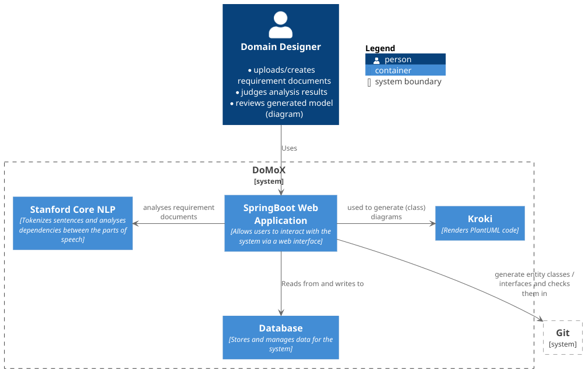
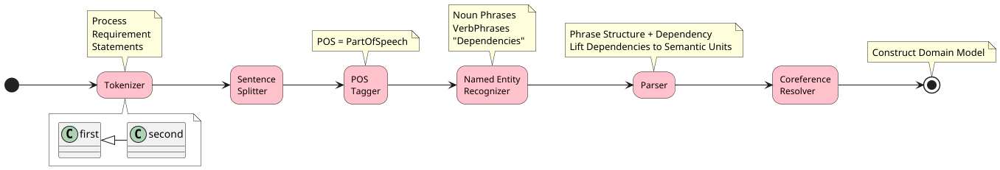
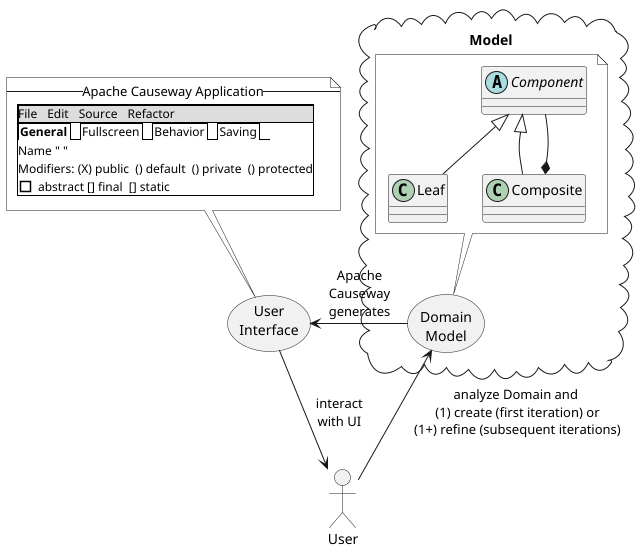

# DoMoX
## 📜 Description
DoMoX is like Vibe Coding, but in an
* 🏛️ old-fashioned / best-practice-based,
* 📐 deterministic,  
* 🔍 fully traceable way, and with
* 🧑 humans in the loop 🔁,

i.e. (almost) without AI.

From 
* textual requirements 
* candidates for classes, responsibilities, and collaborators are identified [1],
* leveraging [Natural Language Processing (NLP)](#NLP) techniques [2],[3].

From these candidates a Domain Model is distilled by designers, 
who select which of the suggested entity classes, properties, actions, and associations should enter the model.
Relevant candidates are flagged for inclusion in the resulting Domain Model (DM).

The DM (Domain Model) is visualized as UML diagram(s), which can be reviewed and modified. 
You could stop here and use the DM as a blueprint for manual coding, but DoMoX can also generate code!

Leveraging Apache Causeway [4], an object-oriented web UI can be generated, alongside the backend part (including DB).
The UI is key to user interactions with the model, and it can be used to validate the model with stakeholders.
If the user experience can be improved, further requirements are fed into the next [iteration](#MDD).

### Key Benefits
* The generated code is fully traceable to the Domain Model and requirements,
* Apache Causeway provides not only a web UI, but also a REST API, than can easily be adapted to AI's (MCP).

## 🥞 Tech Stack
Tools applied in DoMoX include:
* UML, here PlantUML [5]
* JVM implementation, using:
  * Spring Boot, 
  * Apache Causeway, 
  * Maven
* Docker, running:
  * PostgreSQL, 
  * StanfordCoreNLP, 
  * Kroki

## 📚 References
[1] K. Beck and W. Cunningham, 
"A laboratory for teaching object-oriented thinking," 
ACM SIGPLAN Notices, vol. 24, no. 10, pp. 1–6, Oct. 1989, doi: 10.1145/74878.74879.

[2] C. Arora, M. Sabetzadeh, L. Briand, and F. Zimmer, 
"Extracting domain models from natural-language requirements: Approach and industrial evaluation," 
in Proc. 19th ACM/IEEE Int. Conf. Model Driven Eng. Lang. Syst. (MODELS), Saint-Malo, France, Oct. 2016, pp. 250–260, doi: 10.1145/2976767.2976769.
https://people.svv.lu/sabetzadeh/pub/MODELS16.pdf

[3] M. Javed and Y. Lin, 
"iMER: Iterative process of entity relationship and business process model extraction from the requirements," 
Information and Software Technology, vol. 135, p. 106558, Jul. 2021, doi: 10.1016/j.infsof.2021.106558.

[4] Apache Causeway: https://causeway.apache.org/

[5] PlantUML: https://plantuml.com/

## Diagrams
### Container Diagram

### NLP

### MDD
