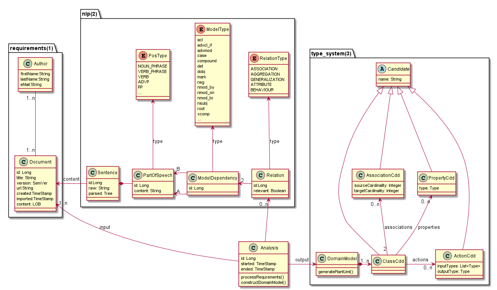

# domox
Domain Model Extractor: automatically extract a (first iteration) domain model from requirements.
By means of Natural Language Processing (NLP), it will try to identify candidates for:

* Classes
* Properties
* Actions and
* Associations

Domox allows the user to:
* Import Documents
* Analyze Requirements therein
* Extract Relations
* Generate a Domain Model (UML)
* Flag relations as irrelevant (ie. exclude them from the Domain Model)
* View the (plant)UML model and
* Export it (for subsequent processing by other tools, eg. Apache Isis)
* Allow to trace back from the Domain Model elements to requirements.  

Design follows the outline in [1]:

 

NLP Processing usually is as follows:

### Glossary
* NER - Named Entity Recognition
* POS - Part of Speech (Taggigng)
* Sofa - Subject of Analysis
* Boilerplate
* Tokenization
* Sentence Splitting
* Parsing
* Co-reference Resolution (synonyms)
* Lemmatization
* Stemming
* Annotation (refrence to text, begin/end)
* Type System - output 
* AE - Analysis Engine

### References
[1] C. Arora, M. Sabetzadeh, L. Briand, and F. Zimmer (2016). 
Extracting Domain Models from Natural-Language Requirements: 
Approach and Industrial Evaluation. 
https://people.svv.lu/sabetzadeh/pub/MODELS16.pdf

[2] P. Coad, E. Lefebvre, and J. De Luca (1999). 
Java Modeling in Color with UML.
Enterprise Components and Processes.
ISBN 0-13-011510-X

#### Excerpt from [1]:
Syntactic parsing (SP) is the key enabling NLP technology.
It consists of:
* Phrase structure parsing
    * noun phrases (NP) 
    * verb phrases (VP) / verb (VB)
* dependency parsing (functional constituents, parse tree)
    * subject
    * object
    
There are four kinds of relations:
* (regular) Association
* Aggregation
* Generalization
* Attribute

A Domain Model has:
* 1..n Concepts
* 1..n Attributes
* 1..n Associations 

### Various
#### Ideas
* Colorize ClassCandidates by means of their properties/actions [2]
* temporal relations -> activity diagrams (HeidelTime?)

#### Tools
* Apache OpenNLP 
    * Home https://opennlp.apache.org/
    * Tutorialspoint: https://www.tutorialspoint.com/opennlp/opennlp_command_line_interface.htm
    * Baeldung: https://www.baeldung.com/apache-open-nlp
* Lucene NLP: https://fabian-kostadinov.github.io/2018/09/08/introduction-to-lucene-opennlp-part1/
* Apache UIMA
* Apache cTAKES
* BRAT https://brat.nlplab.org/index.html

#### Search Terms
* Rdd
