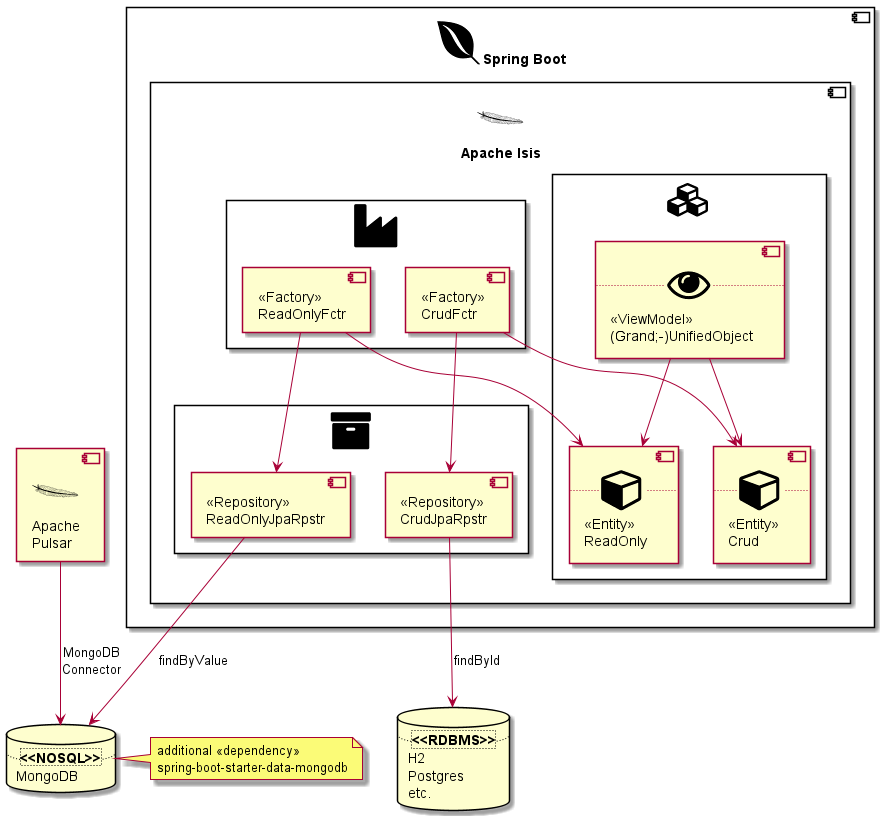

= Message Simulator

== System Context

== Datastore

|===
| | Command |Query

| Crud Verbs |create, update, delete | read
| identification |by reference | by value |

|===

|===
| DB Type | RDBMS | NoSQL

| datastore, dataprovider | transactional | n/a
| mutations | Transactions | Events
| mode | read/write | write once, read mostly
| DDD | Core Domain | Supporting Domain
| Consistency | ensured (ACID) | eventual
|===

